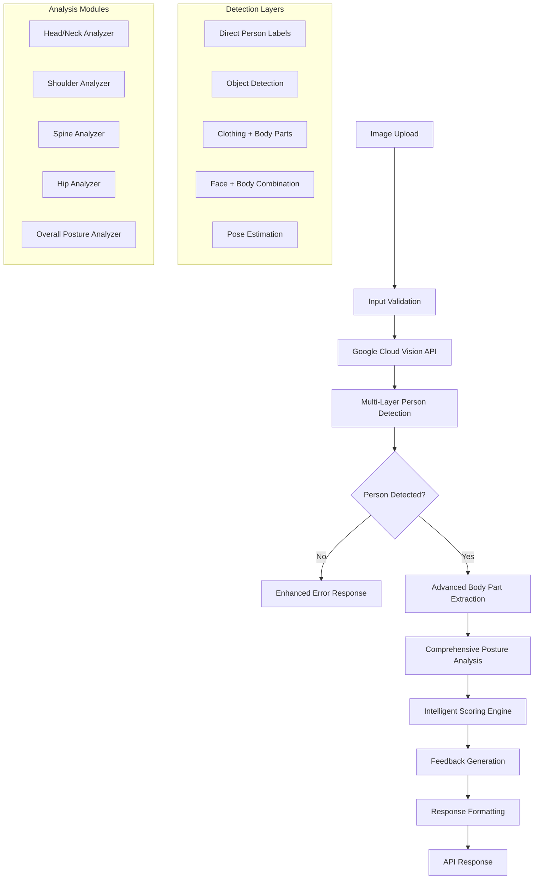

# Design Document

## Overview

The Enhanced Posture Analysis system improves upon the existing Google Cloud Vision API-based posture analysis by implementing more sophisticated person detection algorithms, comprehensive body part analysis, and accurate posture grading. The system maintains the current API structure while significantly enhancing the accuracy and reliability of posture assessment.

The design focuses on three core improvements:
1. **Multi-layered Person Detection**: Combining multiple detection strategies for 90%+ accuracy
2. **Advanced Body Part Analysis**: Sophisticated algorithms for analyzing posture components
3. **Intelligent Posture Grading**: Evidence-based scoring with proper weighting and consistency

## Architecture

### Current Architecture Analysis
The existing system uses a single-endpoint approach with Google Cloud Vision API, processing images through label detection, face detection, and object localization. The current implementation has limitations in person detection reliability and posture analysis accuracy.

### Enhanced Architecture Components



## Components and Interfaces

### 1. Enhanced Person Detection Engine

**Purpose**: Implement multi-layered detection strategy for reliable person identification

**Key Components**:
- **Primary Detection Layer**: Direct person/human labels with confidence thresholds
- **Secondary Detection Layer**: Object localization for person objects
- **Tertiary Detection Layer**: Clothing + body part combination analysis
- **Quaternary Detection Layer**: Face detection + body part correlation
- **Pose Estimation Layer**: Advanced pose detection using landmark analysis

**Detection Algorithm**:
```typescript
interface PersonDetectionResult {
  detected: boolean;
  confidence: number;
  detectionMethods: string[];
  bodyPartsFound: string[];
  clothingFound: string[];
  faceData?: FaceAnnotation;
}

interface DetectionLayer {
  name: string;
  weight: number;
  threshold: number;
  analyze(visionData: CloudVisionResponse): DetectionScore;
}
```

**Enhanced Detection Criteria**:
- Lower confidence thresholds (0.6 instead of 0.7) for better sensitivity
- Expanded keyword dictionaries with anatomical terms
- Contextual analysis (clothing + body parts + environment)
- Pose-specific detection patterns
- Lighting condition compensation

### 2. Advanced Body Part Analysis Engine

**Purpose**: Extract and analyze detailed body part information for comprehensive posture assessment

**Key Components**:
- **Body Part Extractor**: Enhanced keyword matching with anatomical precision
- **Spatial Relationship Analyzer**: Analyze relative positions of body parts
- **Pose Classification Engine**: Identify specific poses and positions
- **Alignment Calculator**: Measure deviations from ideal posture

**Body Part Categories**:
```typescript
interface BodyPartMap {
  head: string[];
  neck: string[];
  shoulders: string[];
  arms: string[];
  torso: string[];
  spine: string[];
  hips: string[];
  legs: string[];
  feet: string[];
}

interface SpatialAnalysis {
  headPosition: 'forward' | 'neutral' | 'backward';
  shoulderLevel: 'even' | 'leftHigh' | 'rightHigh';
  spineAlignment: 'straight' | 'curved' | 'twisted';
  hipAlignment: 'level' | 'tilted' | 'rotated';
}
```

### 3. Comprehensive Posture Analysis Modules

#### Head/Neck Analysis Module
- **Face angle analysis**: Tilt, pan, and roll measurements
- **Forward head posture detection**: Using face position relative to body
- **Neck strain indicators**: Based on angle measurements and body positioning
- **Cervical alignment assessment**: Analyzing neck curve and position

#### Shoulder Analysis Module
- **Shoulder height comparison**: Detecting elevation differences
- **Rounded shoulder detection**: Using arm and torso positioning
- **Shoulder blade positioning**: Analyzing upper back alignment
- **Tension indicators**: Based on shoulder elevation and positioning

#### Spine Analysis Module
- **Spinal curvature analysis**: Detecting excessive kyphosis/lordosis
- **Forward flexion detection**: Critical bending position identification
- **Lateral deviation analysis**: Scoliosis indicators
- **Postural stability assessment**: Overall spine positioning

#### Hip Analysis Module
- **Pelvic tilt detection**: Anterior/posterior tilt analysis
- **Hip level assessment**: Detecting uneven hip positioning
- **Lower back alignment**: Lumbar spine relationship to pelvis
- **Core stability indicators**: Hip positioning stability

#### Overall Posture Module
- **Global alignment assessment**: Full body posture evaluation
- **Compensatory pattern detection**: Identifying postural adaptations
- **Risk factor analysis**: Injury risk assessment
- **Movement quality indicators**: Dynamic posture assessment

### 4. Intelligent Scoring Engine

**Purpose**: Provide accurate, consistent, and meaningful posture scores

**Scoring Algorithm**:
```typescript
interface ScoringWeights {
  spine: 0.30;        // Most critical for health
  shoulders: 0.20;    // Major postural component
  headNeck: 0.20;     // Critical for neck health
  hips: 0.15;         // Foundation of posture
  overall: 0.15;      // Global assessment
}

interface ScoreCalculation {
  baseScore: number;
  penalties: PosturePenalty[];
  bonuses: PostureBonus[];
  finalScore: number;
  confidence: number;
}
```

**Scoring Criteria**:
- **Excellent (85-100)**: Optimal posture with minimal deviations
- **Good (70-84)**: Generally good posture with minor issues
- **Fair (50-69)**: Moderate issues requiring attention
- **Poor (0-49)**: Significant problems requiring immediate action

**Penalty System**:
- Critical issues (90° bending): -80 points
- Major issues (rounded shoulders): -45 points
- Moderate issues (head tilt): -25 points
- Minor issues (slight asymmetry): -10 points

### 5. Enhanced Feedback Generation System

**Purpose**: Provide actionable, prioritized, and educational feedback

**Feedback Categories**:
- **Critical Alerts**: Immediate safety concerns
- **Major Issues**: Significant postural problems
- **Improvement Areas**: Moderate issues with solutions
- **Maintenance Tips**: Preventive recommendations

**Recommendation Engine**:
```typescript
interface RecommendationSystem {
  immediate: string[];     // Urgent corrections
  shortTerm: string[];     // 1-4 week goals
  longTerm: string[];      // 1-3 month goals
  exercises: Exercise[];   // Specific corrective exercises
  lifestyle: string[];     // Daily habit changes
}
```

## Data Models

### Enhanced PostureAnalysis Interface
```typescript
interface EnhancedPostureAnalysis {
  // Core Results
  score: number;
  status: "excellent" | "good" | "fair" | "poor";
  confidence: number;
  
  // Detection Results
  personDetected: boolean;
  faceDetected: boolean;
  detectionMethods: string[];
  
  // Analysis Results
  detailedAnalysis: {
    headNeck: BodyPartAnalysis;
    shoulders: BodyPartAnalysis;
    spine: BodyPartAnalysis;
    hips: BodyPartAnalysis;
    overall: BodyPartAnalysis;
  };
  
  // Feedback
  feedback: CategorizedFeedback;
  recommendations: PrioritizedRecommendations;
  
  // Metadata
  analysisMetadata: {
    imageQuality: number;
    lightingConditions: string;
    bodyVisibility: number;
    processingTime: number;
  };
}

interface BodyPartAnalysis {
  score: number;
  issues: PostureIssue[];
  measurements?: PostureMeasurements;
  riskLevel: 'low' | 'moderate' | 'high' | 'critical';
}

interface PostureIssue {
  type: string;
  severity: 'minor' | 'moderate' | 'major' | 'critical';
  description: string;
  impact: string;
  recommendations: string[];
}
```

## Error Handling

### Enhanced Error Response System
```typescript
interface PostureAnalysisError {
  success: false;
  errorType: 'PERSON_NOT_DETECTED' | 'IMAGE_QUALITY' | 'API_ERROR' | 'PROCESSING_ERROR';
  errorCode: string;
  message: string;
  suggestions: string[];
  retryable: boolean;
}
```

### Error Categories
1. **Person Detection Failures**: Specific guidance for improving person visibility
2. **Image Quality Issues**: Lighting, resolution, and clarity problems
3. **API Service Errors**: External service failures with fallback options
4. **Processing Errors**: Internal analysis failures with recovery strategies

## Testing Strategy

### Unit Testing
- **Person Detection Tests**: Various poses, lighting conditions, and image qualities
- **Body Part Analysis Tests**: Specific posture conditions and edge cases
- **Scoring Algorithm Tests**: Consistency and accuracy validation
- **Error Handling Tests**: All failure scenarios and recovery paths

### Integration Testing
- **Google Cloud Vision API Integration**: API response handling and error scenarios
- **End-to-End Analysis Pipeline**: Complete image processing workflow
- **Performance Testing**: Response times and resource usage
- **Accuracy Testing**: Comparison with manual posture assessments

### Test Data Requirements
- **Diverse Image Dataset**: Various poses, lighting, backgrounds, and demographics
- **Ground Truth Data**: Manual posture assessments for accuracy validation
- **Edge Case Images**: Challenging scenarios for robustness testing
- **Performance Benchmarks**: Response time and accuracy targets

### Validation Metrics
- **Person Detection Accuracy**: Target 90%+ detection rate
- **Posture Scoring Consistency**: ±5 points for similar postures
- **Response Time**: <3 seconds for analysis completion
- **Error Rate**: <5% for valid person images

## Performance Considerations

### Optimization Strategies
- **Efficient Vision API Usage**: Optimized feature requests and result processing
- **Caching Strategy**: Cache analysis results for similar images
- **Parallel Processing**: Concurrent analysis of different body regions
- **Memory Management**: Efficient handling of image data and analysis results

### Scalability Planning
- **Rate Limiting**: Handle API quotas and request limits
- **Load Balancing**: Distribute analysis requests across multiple instances
- **Database Optimization**: Efficient storage of analysis results and user data
- **CDN Integration**: Fast image delivery and processing

## Security and Privacy

### Data Protection
- **Image Processing**: No permanent storage of user images
- **Analysis Results**: Encrypted storage of posture data
- **API Security**: Secure handling of API keys and credentials
- **User Privacy**: Minimal data collection and retention

### Compliance Considerations
- **HIPAA Compliance**: Health data handling requirements
- **GDPR Compliance**: User data protection and consent
- **Data Retention**: Automatic deletion of sensitive data
- **Audit Logging**: Comprehensive logging for security monitoring